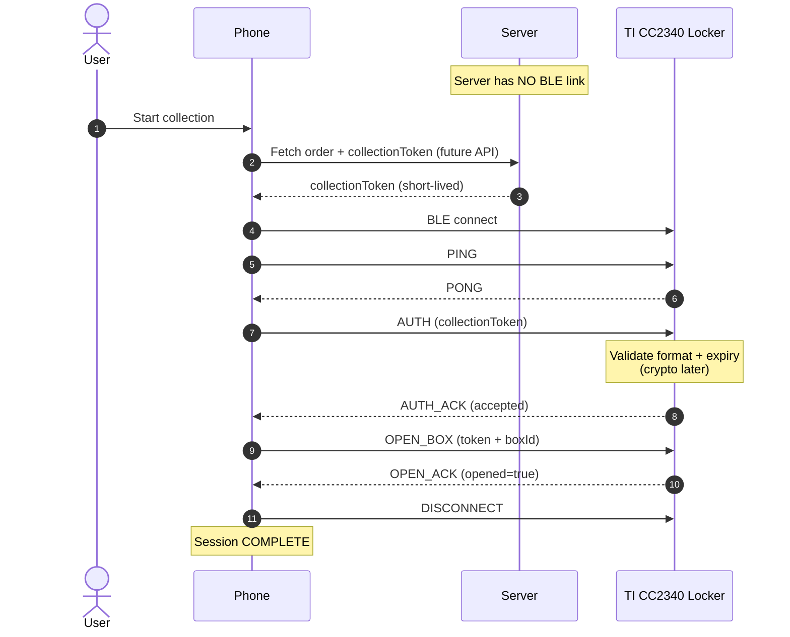
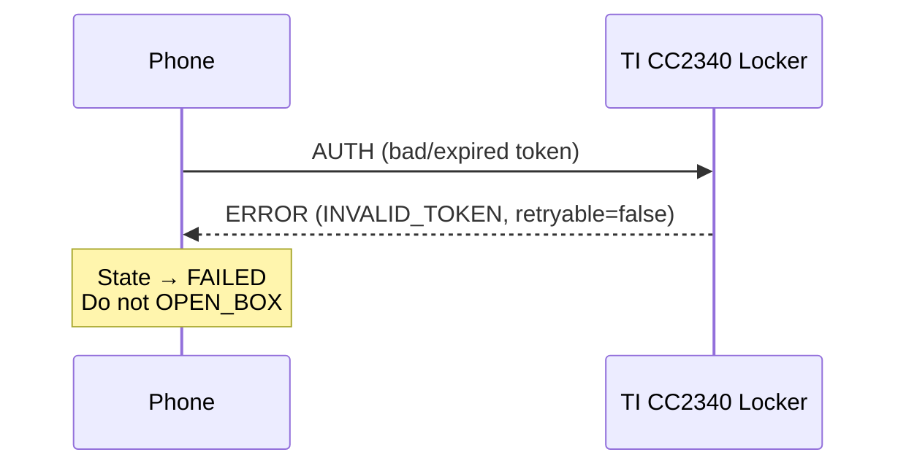
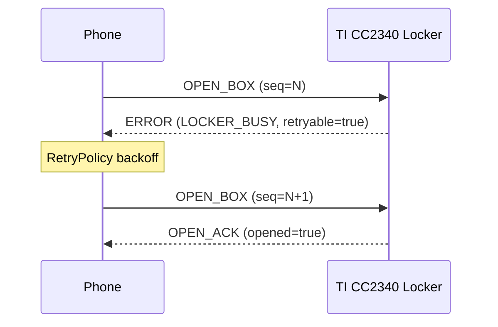
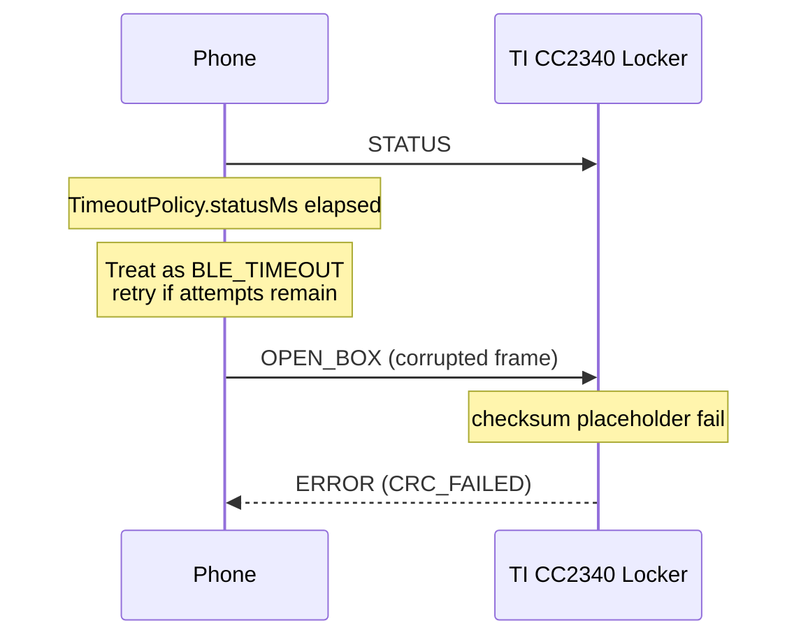
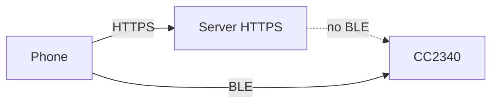

# Sequence diagrams

## Happy path — collect from locker

```mermaid
sequenceDiagram
  autonumber
  actor User
  participant Phone
  participant Server
  participant Locker as TI CC2340 Locker

  Note over Server: Server has NO BLE link
  User->>Phone: Start collection
  Phone->>Server: Fetch order + collectionToken (future API)
  Server-->>Phone: collectionToken (short-lived)

  Phone->>Locker: BLE connect
  Phone->>Locker: PING
  Locker-->>Phone: PONG

  Phone->>Locker: AUTH (collectionToken)
  Note over Locker: Validate format + expiry<br/>(crypto later)
  Locker-->>Phone: AUTH_ACK (accepted)

  Phone->>Locker: OPEN_BOX (token + boxId)
  Locker-->>Phone: OPEN_ACK (opened=true)

  Phone->>Locker: DISCONNECT
  Note over Phone: Session COMPLETE
```

## Auth failure — invalid / expired token

```mermaid
sequenceDiagram
  participant Phone
  participant Locker as TI CC2340 Locker

  Phone->>Locker: AUTH (bad/expired token)
  Locker-->>Phone: ERROR (INVALID_TOKEN, retryable=false)
  Note over Phone: State → FAILED<br/>Do not OPEN_BOX
```

## Open retry — locker busy

```mermaid
sequenceDiagram
  participant Phone
  participant Locker as TI CC2340 Locker

  Phone->>Locker: OPEN_BOX (seq=N)
  Locker-->>Phone: ERROR (LOCKER_BUSY, retryable=true)
  Note over Phone: RetryPolicy backoff
  Phone->>Locker: OPEN_BOX (seq=N+1)
  Locker-->>Phone: OPEN_ACK (opened=true)
```

## Timeout / CRC failure

```mermaid
sequenceDiagram
  participant Phone
  participant Locker as TI CC2340 Locker

  Phone->>Locker: STATUS
  Note over Phone: TimeoutPolicy.statusMs elapsed
  Note over Phone: Treat as BLE_TIMEOUT<br/>retry if attempts remain

  Phone->>Locker: OPEN_BOX (corrupted frame)
  Note over Locker: checksum placeholder fail
  Locker-->>Phone: ERROR (CRC_FAILED)
```

## Roles reminder

```mermaid
flowchart LR
  Server[Server HTTPS] -. no BLE .-> Locker[CC2340]
  Phone[Phone] -- HTTPS --> Server
  Phone -- BLE --> Locker
```
