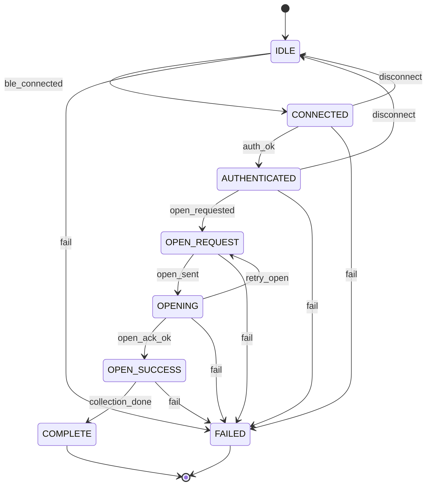

# State machine

Phone-side collection session (protocol view). Implemented as `BleSessionStateMachine` in `protocol/ble/stateMachine.js`.

## States

| State | Meaning |
|-------|---------|
| `IDLE` | No BLE session |
| `CONNECTED` | Link up; not authenticated |
| `AUTHENTICATED` | Token accepted |
| `OPEN_REQUEST` | App decided to open |
| `OPENING` | `OPEN_BOX` sent; awaiting ACK |
| `OPEN_SUCCESS` | `OPEN_ACK.opened === true` |
| `COMPLETE` | Collection flow finished |
| `FAILED` | Terminal failure (token, timeout budget, fatal ERROR) |

## Happy path

```text
IDLE
  → CONNECTED
  → AUTHENTICATED
  → OPEN_REQUEST
  → OPENING
  → OPEN_SUCCESS
  → COMPLETE
```

## Diagram



## Failure & retry handling

| Condition | Action |
|-----------|--------|
| `INVALID_TOKEN` / `INVALID_BOX` | `fail` → `FAILED` (no retry) |
| `LOCKER_BUSY` | Stay / return to `OPEN_REQUEST`, apply `RetryPolicy` |
| `BLE_TIMEOUT` | Retry request until `maxAttempts`, then `FAILED` |
| `CRC_FAILED` | Re-send same logical command with **new** sequence number |
| `DOOR_ALREADY_OPEN` | Treat as success-equivalent or `FAILED` per product rule (default: surface error, no motor retry) |
| Link drop before COMPLETE | `disconnect` → `IDLE` (user may reconnect with same token if not expired) |

## Events API (design)

```text
ble_connected → CONNECTED
auth_ok → AUTHENTICATED
open_requested → OPEN_REQUEST
open_sent → OPENING
open_ack_ok → OPEN_SUCCESS
collection_done → COMPLETE
retry_open → OPEN_REQUEST
disconnect → IDLE
fail → FAILED
```
