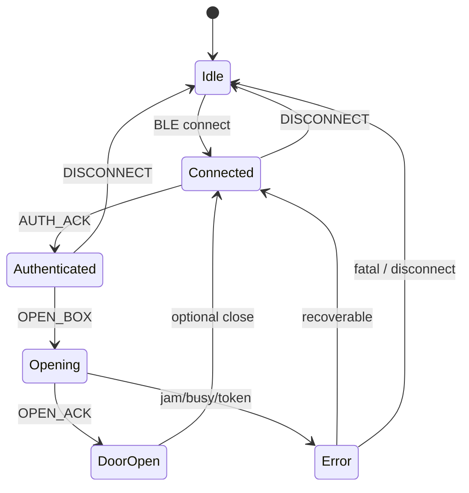

# MCU session state (firmware view)

```text
POWER_ON
  → IDLE (bleConnected=false)
  → BLE_CONNECTED
  → AUTHENTICATED (after AUTH_ACK)
  → OPENING (motor + door)
  → DOOR_OPEN / ERROR
  → DISCONNECTED → IDLE
```



Phone-side `LockerState` (Phase 11) remains the UI-facing machine; this diagram is the **MCU-internal** view.
